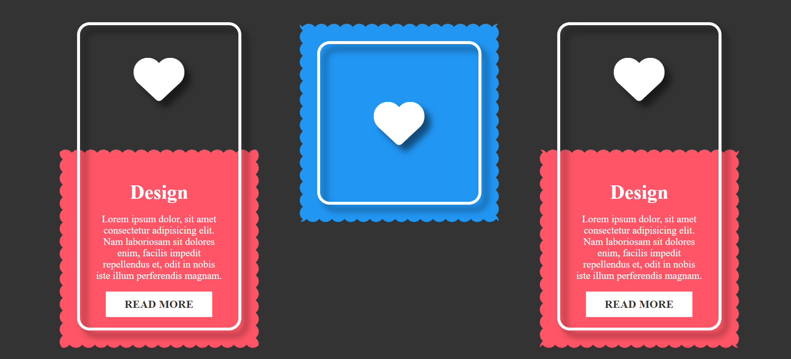

# Reveal Card Content on Hover

## Description
This HTML/CSS code snippet showcases an interactive design layout featuring hover effects. Each box contains an icon with accompanying text, providing a visually appealing display. As you hover over each box, the icon moves upward, revealing more content and triggering a dynamic background animation. This snippet demonstrates how to create engaging user experiences through simple yet effective design techniques.

## Usage
To use this code snippet, simply copy the HTML and CSS provided in the index.html and style.css files respectively. You can customize the colors, content, and animations to suit your project's needs.

## Preview

## Technologies Used
- HTML
- CSS

## Author
[Your Name]

## License
This project is licensed under the [MIT License](LICENSE).

## Hashtags
#HTML #CSS #WebDesign #UI #UX #HoverEffects #InteractiveDesign #FrontEndDevelopment #CreativeCoding #WebDevelopment #CodeSnippet #DesignInspiration #UserExperience #VisualDesign #RevealCardContentonHover
